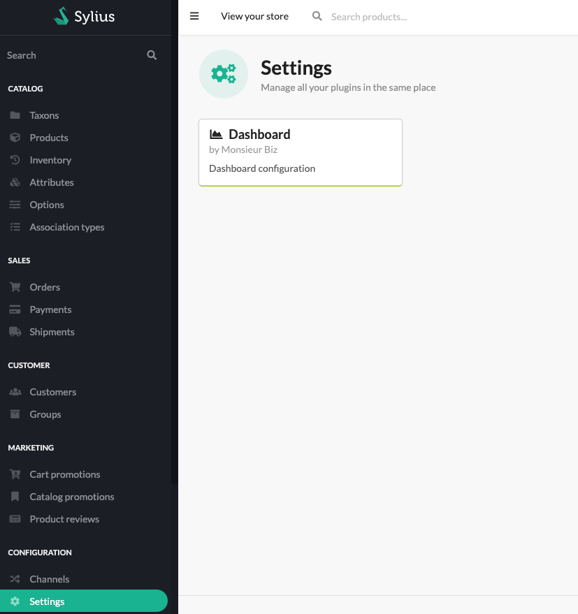
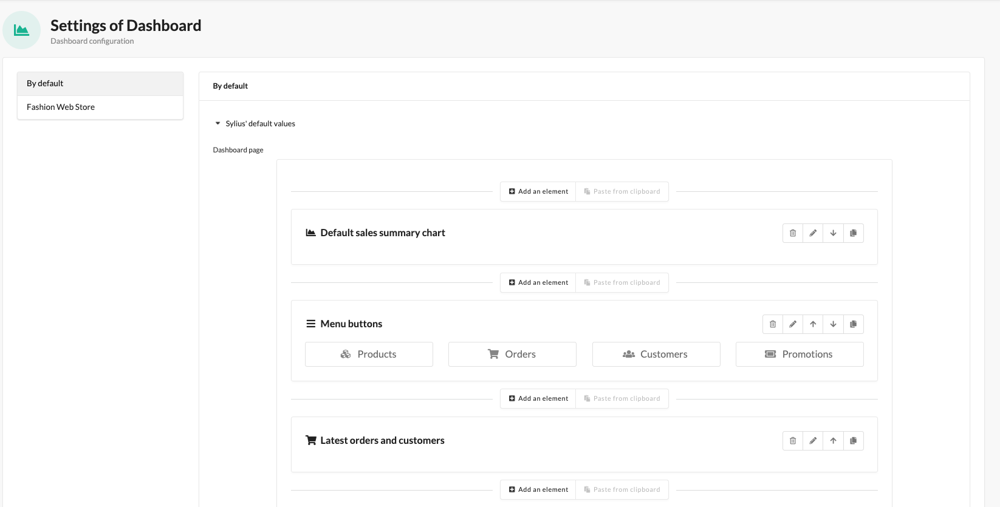
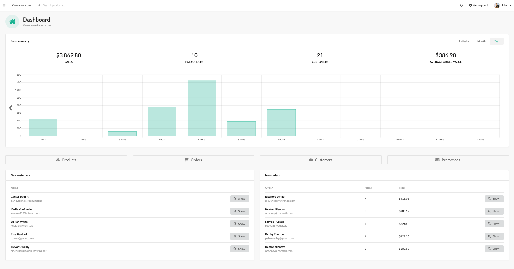

<p align="center">
    <a href="https://monsieurbiz.com" target="_blank">
        
    </a>
    &nbsp;&nbsp;&nbsp;&nbsp;
    <a href="https://monsieurbiz.com/agence-web-experte-sylius" target="_blank">
        
    </a>
    <br/>
    
</p>

<h1 align="center">Dashboard for Sylius</h1>

[](https://github.com/monsieurbiz/SyliusDashboardPlugin/blob/master/LICENSE)
[](https://github.com/monsieurbiz/SyliusDashboardPlugin/actions?query=workflow%3ATests)
[](https://github.com/monsieurbiz/SyliusDashboardPlugin/actions?query=workflow%3ASecurity)

This plugin allows the admin to change the dashboard page of the admin panel.
By default the plugin is showing 3 blocks that are similar to the default ones of sylius.

## Installation

Install the plugin via composer:

```bash
composer require monsieurbiz/sylius-dashboard-plugin
```





## Contributing

You can find a way to run the plugin without effort in the file [DEVELOPMENT.md](./DEVELOPMENT.md).

Then you can open an issue or a Pull Request if you want! 😘  
Thank you!

## License

This plugin is completely free and released under the [MIT License](https://github.com/monsieurbiz/SyliusDashboardPlugin/blob/master/LICENSE).
